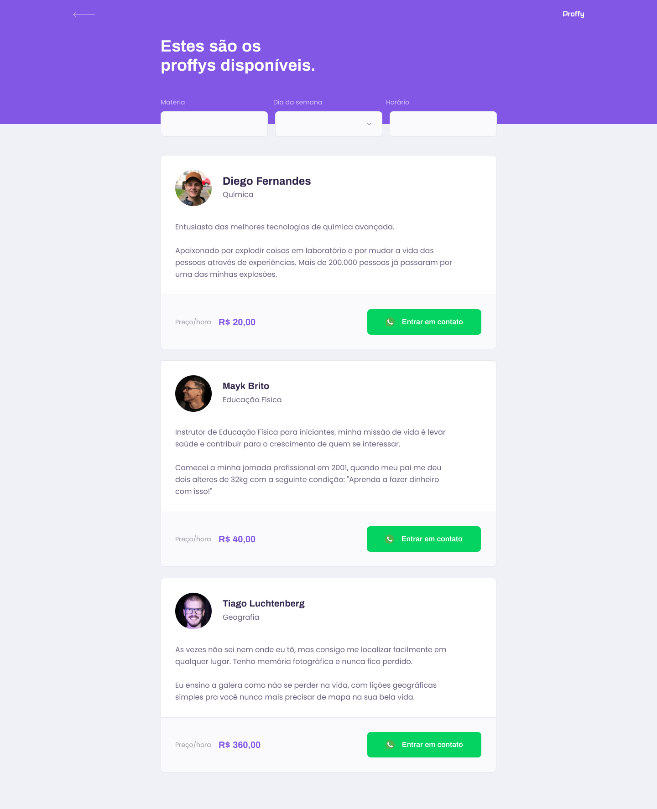
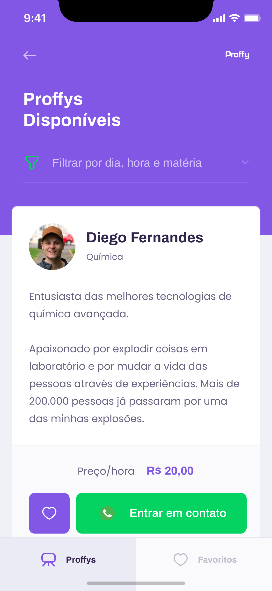

# Proffy

Here are the three applications developed for this project.  

💻 [Frontend](https://github.com/fm4teus/nlw-2/tree/master/web) | 
💾 [Backend](https://github.com/fm4teus/nlw-2/tree/master/server) | 
📱 [Mobile](https://github.com/fm4teus/nlw-2/tree/master/mobile)

## 📑 About this Project

Proffy is a project developed during the 2nd edition of [Rocketseat](https://rocketseat.com.br)'s Next Level Week, which connects students and teachers.

## 📚 Functionality
- Student area, where the user can search for teachers and subjects.
- Teacher area, where the user can register subjects, schedules, prices and contact.

## 💡 Why?
This project is part of my personal portfolio and I would be very happy to receive feedback on the project, code, structure, anything that can make me a better developer!

E-mail: <a href="mailto:fm4teus@gmail.com">fm4teus@gmail.com</a> | 
LinkedIn: <a href="https://www.linkedin.com/in/fm4teus/" target="_blank">fm4teus</a>

Also, you can use this design as you want, it's free to copy, change and improve.

## 🎨 Design
The idea for this theme came in celebration of the National Day of Education Professionals in Brazil that takes place on August 6th.

<table style="border: none">
  <tr>
    <td colspan="2">Desktop</td>
    <td colspan="2">Mobile</td>
  </tr>
  <tr>
    <td></td><td></td>
    <td></td><td></td>
  </tr>
</table>

Design made by [Tiago Luchtenberg](https://www.instagram.com/tiagoluchtenberg/).

## 📥 How to use

- Clone this repository: `git clone https://github.com/fm4teus/nlw-2.git`

To run the application just open the directories and execute the commands below:
- Install dependencies: `yarn install`
- If your database isn't set yet, run `yarn knex:migrate` on the [Server](https://github.com/fm4teus/nlw-2/tree/master/server)
- Run application: `yarn start`

Note that the [Web](https://github.com/fm4teus/nlw-2/tree/master/web) folder contains the responsive application developed for the browser. The 
[Mobile](https://github.com/fm4teus/nlw-2/tree/master/mobile) folder contains the project for mobile devices. The [Server](https://github.com/fm4teus/nlw-2/tree/master/server) folder contains the project backend, which must always be running for both applications to work as expected.

## 🚀 Build With
- [ReactJS](https://reactjs.org/)
- [React Native](https://reactnative.dev/)
- [Node.js](https://nodejs.org/en/)
- [TypeScript](https://www.typescriptlang.org)

## 📕 License
The software is available under the [MIT License](https://github.com/fm4teus/nlw-2/blob/master/LICENSE).
